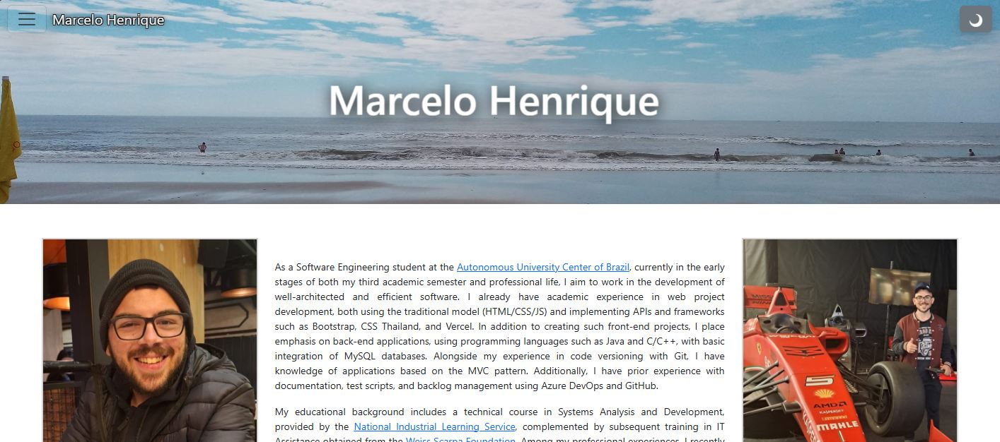

# Portfolio Website

This is my responsive portfolio website built with **Bootstrap** and deployed on **Vercel**, following **semantic HTML** best practices.

## Features

- Responsiveness using Bootstrap
- Semantic HTML structure
- Modern UI with smooth animations
- Deeployment with Vercel

#### Technologies Used

| Technology | Purpose |
|------------|---------|
|  | Structure |
|  | Styling |
|  | Animations |
|  | Framework |
|  | Deployment |

## Learnings

### What I learned in this project?

> **Response:** _Belong this project I learned how to manage web elements with [Bootstrap's framework](https://getbootstrap.com/). That website had introduced me for JavaScript animations, HTML semantic and responsive concepts._

### How this works?

> **Response:** _This website is provided by [Vercel's framework](https://vercel.com/), most used for deploying website, it offers statistics unlike visit's counting for analysis._

### Inspirations?

> **Response:** _This project is based on my professor [Thiago Nascimento website](https://sites.google.com/site/nascimenthiago/home?authuser=0) and [C418 album's page](https://c418.org/albums/minecraft-volume-alpha/)._

## Developer

This project was developed by [@MarcDevGuy127](https://www.github.com/MarcDevGuy127).